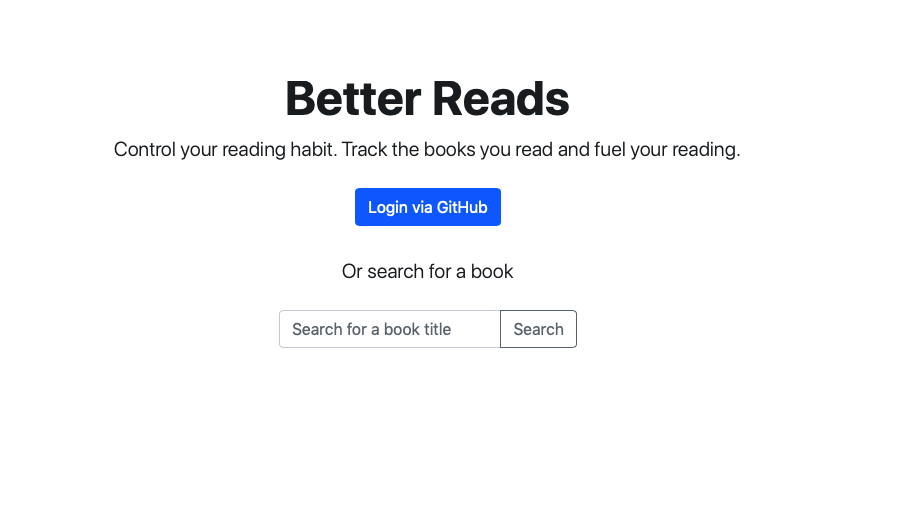

# BetterReads

**BetterReads** is a replica of GoodReads.

Two microservice have been created to make BetterReads app.

**1. data-loader**
is a spring boot app to load data from local file to cassandra db.

**2. books-app**
is a web app were user can search book by title or author, view book, can mark book reading status and can also rate book.

## Tech Stack

|  |  |
| --- | --- |
| **Backend**  | Spring Boot  |
| **Database**  | Cassandra  |
| **Cloud** | DataStax Astra |
| **UI** | Thymeleaf |
| **Security** | Spring Security |
| **OAuth** | Github |

